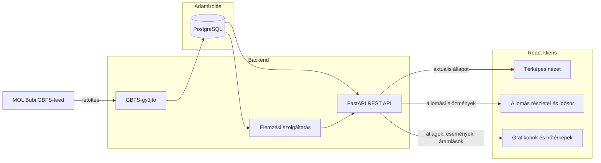

# MOL Bubi hálózatelemző és készletmonitor

Webes alkalmazás a MOL Bubi állomások állapotának gyűjtésére és elemzésére. A rendszer a nyilvános GBFS-feedből időbélyeges adatokat ment az elérhető kerékpárokról és a szabad dokkolókról.

## Funkcionális terv

Az alkalmazás fő funkciói:

- GBFS-feed automatikus letöltése és mentése
- állomásonkénti aktuális állapot megjelenítése térképen
- állomásonkénti idősor az elérhető biciklikről és dokkolókról
- átlagos kihasználtság elemzése napszak és hét napja szerint
- üres és teli állomások gyakoriságának hőtérképe
- bővítésként becsült ki- és berakási forgalom, nettó áramlás, forrás- és nyelőállomások

## Statikus terv

```text
MOL Bubi GBFS-feed
        |
        v
Validálás és PostgreSQL adatbázis
        |
        v
FastAPI REST API --> React kliens
        |
        v
Térkép, grafikonok és hőtérképek
```

### Komponensdiagram



Az adatgyűjtés a GBFS-feedből indul, a validált állomás- és snapshotadatok
PostgreSQL-ben tárolódnak. A FastAPI REST API szolgálja ki a React kliens
térképes és elemzési nézeteit.


Tervezett API-végpontok:

- `GET /api/stations` - állomások és aktuális állapotuk
- `GET /api/stations/{id}/history` - állomási idősor
- `GET /api/analytics/averages` - napszak és hét napja szerinti átlagok
- `GET /api/analytics/events` - üres/teli események
- `GET /api/analytics/flows` - becsült nettó áramlások
- `GET /api/health` - rendszer- és gyűjtési állapot

## Felületterv

### Térképes kezdőoldal

- Budapest térképe állomásjelölőkkel
- színkód az elérhető biciklik vagy a szabad dokkolók alapján
- keresés és állomásszűrés
- utolsó frissítés és adatok frissessége
- összesített bicikli-, dokkoló- és állomásszám
- kiválasztott állomás részletes oldalsávja

### Elemzési nézet

- állomási idősor vonaldiagramon
- átlagos kihasználtság napszak és hét napja szerint
- üres/teli események hőtérképe
- problémás állomások rangsora
- később becsült forrás- és nyelőállomások

Az üres, betöltési, hibás és elavult adatokhoz külön állapotot kell megjeleníteni. A becsült forgalmat mindig egyértelműen becslésként kell jelölni.

## Implementációs terv

### Technológiák

- **Python**, **FastAPI** a backendhez
- **PostgreSQL** a tartós tároláshoz
- **React** a frontendhez

### Felhasználni kívánt könyvtárak

- **Leaflet / React-Leaflet** - interaktív térkép
- 

### Feldolgozási sorrend

1. GBFS-feed letöltése.
2. A teljes válasz azonnali, időbélyeges mentése.
3. A mentett fájl validálása.
4. Állomásadatok és snapshotok adatbázisba írása.
5. Üres/teli események előállítása.
6. A gyűjtési futás sikerének vagy hibájának naplózása.
7. Az adatok kiszolgálása a React felületnek.

## Megvalósítási lépések

1. Adatbázis-séma és megbízható GBFS-importáló elkészítése.
2. Aktuális állapotot megjelenítő térképes MVP.
3. Idősorok, átlagok és esemény-hőtérkép megvalósítása.
4. Hibakezelés, elavult adatok jelzése, reszponzív felület és tesztek.


